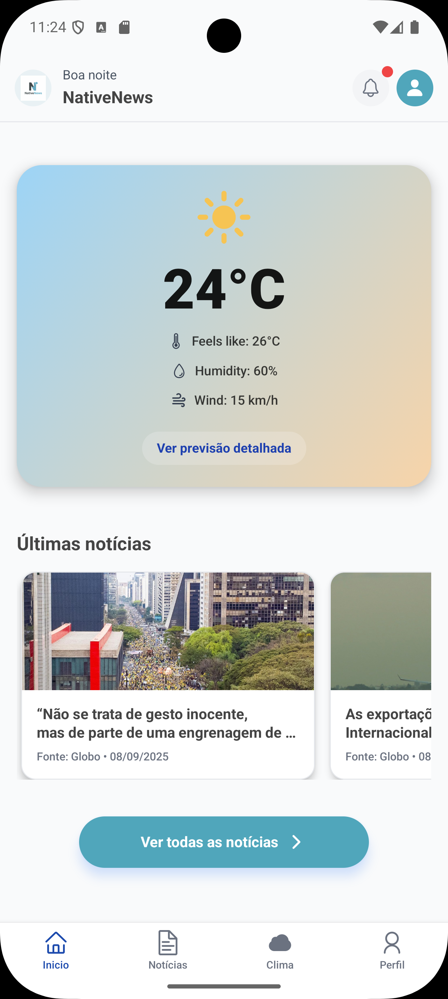
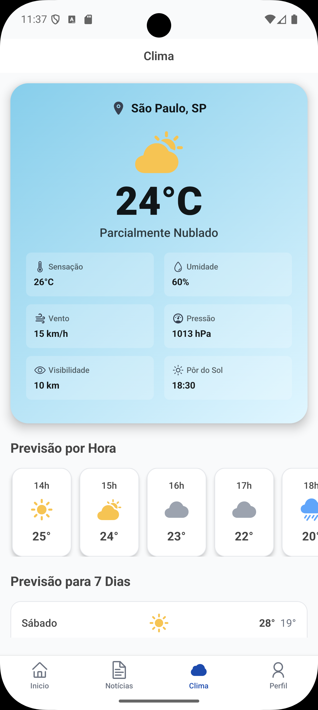

# 📱 NativeNews - React Native App

> Um aplicativo de notícias moderno e elegante construído com React Native, Expo e as melhores práticas de desenvolvimento mobile.

## 🚀 Sobre o Projeto

O **NativeNews** é uma aplicação mobile completa que oferece uma experiência rica para consumo de notícias, com recursos como:

- 📰 Feed de notícias personalizado
- 🌤️ Informações meteorológicas integradas
- 🔍 Sistema de busca avançado
- 🌙 Suporte a tema escuro/claro
- 👤 Autenticação de usuários
- 📊 Dashboard interativo

## 📸 Screenshots do App

<div align="center">
  
  
  
  
</div>

<div align="center">
  
  
  
  
</div>

## 🛠️ Tecnologias Utilizadas

### Core
- **React Native** `0.79.6` - Framework principal
- **Expo** `~53.0.22` - Plataforma de desenvolvimento
- **TypeScript** `~5.8.3` - Tipagem estática
- **Expo Router** `~5.1.5` - Navegação file-based

### UI/UX
- **NativeWind** `^4.1.23` - Styling com Tailwind CSS
- **React Native Reanimated** `~3.17.4` - Animações performáticas
- **Expo Linear Gradient** `~14.1.5` - Gradientes nativos
- **React Native SVG** `15.11.2` - Ícones e ilustrações vetoriais

### Estado e Dados
- **TanStack Query** `^5.85.9` - Gerenciamento de estado servidor
- **React Hook Form** `^7.62.0` - Formulários performáticos
- **Zod** `^4.1.5` - Validação de schemas
- **Axios** `^1.11.0` - Cliente HTTP

### Autenticação e Segurança
- **Firebase** `^12.2.1` - Backend as a Service
- **Expo Secure Store** `^14.2.3` - Armazenamento seguro
- **AsyncStorage** `^1.18.1` - Persistência local

### Experiência do Usuário
- **React Native Toast Message** `^2.3.3` - Notificações
- **Expo Haptics** `~14.1.4` - Feedback tátil
- **React Native App Intro Slider** `^4.0.4` - Onboarding

## 🏗️ Arquitetura e Boas Práticas

### 📁 Estrutura de Pastas
```
src/
├── app/                    # Rotas file-based (Expo Router)
│   ├── (auth)/            # Grupo de autenticação
│   ├── (dashboard)/       # Grupo do dashboard
│   └── (onboarding)/      # Grupo de onboarding
├── components/            # Componentes reutilizáveis
├── context/              # Contextos React
├── hooks/                # Custom hooks
├── services/             # Serviços externos
├── theme/                # Sistema de design
└── utils/                # Utilitários
```

### 🎯 Princípios Aplicados

#### **Clean Architecture**
- Separação clara de responsabilidades
- Componentes modulares e reutilizáveis
- Hooks customizados para lógica de negócio
- Serviços isolados para APIs externas

#### **Performance**
- Lazy loading de componentes
- Otimização de re-renders com React.memo
- Uso de FlatList para listas grandes
- Imagens otimizadas com Expo Image

#### **Segurança**
- Variáveis sensíveis no `.env`
- Armazenamento seguro com Expo Secure Store
- Validação rigorosa com Zod
- Sanitização de dados de entrada

#### **Acessibilidade**
- Labels descritivos em todos os elementos
- Suporte a leitores de tela
- Contraste adequado de cores
- Navegação por teclado

#### **Responsividade**
- Design adaptativo para diferentes tamanhos
- Uso de unidades relativas
- Testes em múltiplos dispositivos
- Suporte a orientação landscape/portrait

## 🚀 Como Executar

### Pré-requisitos
- Node.js (versão 18 ou superior)
- Yarn ou npm
- Expo CLI
- Android Studio ou Xcode (para emuladores)

### Instalação

1. **Clone o repositório**
   ```bash
   git clone <repository-url>
   cd NativeNews-React-Native
   ```

2. **Instale as dependências**
   ```bash
   npm install
   # ou
   yarn install
   ```

3. **Configure as variáveis de ambiente**
   ```bash
   cp .env.example .env
   # Edite o arquivo .env com suas configurações
   ```

4. **Inicie o projeto**
   ```bash
   npx expo start
   ```

### Opções de Execução

- **Android Emulator**: Pressione `a` no terminal
- **iOS Simulator**: Pressione `i` no terminal (apenas macOS)
- **Expo Go**: Escaneie o QR code com o app Expo Go
- **Web**: Pressione `w` no terminal

## 📱 Funcionalidades

### 🔐 Autenticação
- Login com email/senha
- Registro de novos usuários
- Recuperação de senha
- Autenticação persistente

### 📰 Notícias
- Feed personalizado
- Categorias de notícias
- Busca avançada
- Favoritos
- Compartilhamento

### 🌤️ Clima
- Previsão atual
- Previsão estendida
- Localização automática
- Múltiplas cidades

### 👤 Perfil
- Edição de dados pessoais
- Preferências de notificação
- Tema escuro/claro
- Configurações de privacidade

## 🧪 Scripts Disponíveis

```bash
# Desenvolvimento
npm start              # Inicia o servidor Expo
npm run android        # Executa no Android
npm run ios           # Executa no iOS
npm run web           # Executa na web

# Qualidade de Código
npm run lint          # Executa ESLint
npm run format        # Formata código com Prettier
npm run check         # Executa lint + format

# Utilitários
npm run reset-project # Reseta o projeto para estado inicial
```

## 🤝 Contribuição

1. Faça um fork do projeto
2. Crie uma branch para sua feature (`git checkout -b feature/AmazingFeature`)
3. Commit suas mudanças (`git commit -m 'Add some AmazingFeature'`)
4. Push para a branch (`git push origin feature/AmazingFeature`)
5. Abra um Pull Request

## 📄 Licença

Este projeto está sob a licença MIT. Veja o arquivo [LICENSE](LICENSE) para mais detalhes.

## 👨‍💻 Desenvolvedor

Desenvolvido com ❤️ por [Seu Nome]

---

<div align="center">
  
  <p><strong>NativeNews</strong> - Sua fonte de notícias sempre atualizada</p>
</div>
